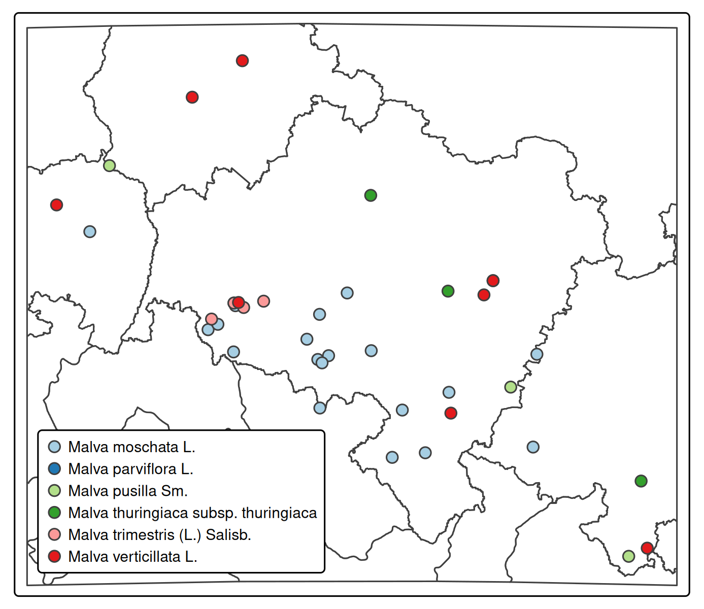

## Flora Silesiae

Historical data of the flora of Silesia based on articles published by
‘Botanische Sektion’ in *Jahres-Bericht der Schlesischen Gesellschaft
für vaterländische Cultur*. Electronic versions of the reports can be
found at [Opole Digital
Library](https://www.obc.opole.pl/dlibra/publication/8613#structure) and
[Silesia Digital
Library](https://www.sbc.org.pl/dlibra/publication/11059#structure)

### How to use

The full data set is saved into `flora_sil.Rds` file. You can read it
using:

``` r
jahres <- readRDS(file = "data/flora_sil.Rds")
```

If you prefer `.csv` data format, to load it into *LibreOffice Calc* or
*Excel* then you will find it in `data/flora_sil.csv` file.

Let’s have a look on `jahres` data frame:

<div class="column-page">

``` r
jahres |>
  dplyr::slice_sample(n = 3) 
```

                             species
    1                Thesium alpinum
    2           Lycopodium inundatum
    3 Equisetum arvense f. campestre
                                                  citation
    1 @vonuechtritzResultateDurchforschungSchlesischen1886
    2      @schubeErgebnisseDurchforschungSchlesischen1916
    3      @schubeErgebnisseDurchforschungSchlesischen1903
                                                                                                                                                                                                                                      entry
    1 Lycopodium complanatum L. var. aanceps Wallr. Zobten: Klein-Silsterwitz, an einer sonnigen trockenen Stelle in der Nähe des Dorfes über dem Bache zwischen Calluna mit Thesium alpinum und Lathyrus silvestris steril!! (Dr. SchncK).
    2                                                                                                                                                                                       Lycopodium inundatum. Rybnik: vor Boguschowitz;
    3                                                                                                                                                                             Equisetum arvense f. campestre. Grünberg: Krampe (ders.)!
           lon      lat                         comments year
    1 16.73092 50.85032                                  1886
    2 18.60987 50.06401                                  1916
    3 15.53103 52.00299 Krępa, Nowe Miasto, Zielona Góra 1903
                         accepted_name
    1               Thesium alpinum L.
    2 Lycopodiella inundata (L.) Holub
    3             Equisetum arvense L.

</div>

Having pair of geographical coordinates – `lon[gitude]` and `lat[itude]`
– it’s very easy to convert the data frame to simple feature df, for
example using `sf` package.

``` r
jahres <- jahres |>
  subset(!is.na(lon)) |>
  sf::st_as_sf(coords = c("lon", "lat"), crs = "EPSG:4326")
```

Now it’s quite easy to run any spatial analysis like distribution, or
density. Let’s have a look on distribution of malvas:

``` r
malvas <- jahres |>
  subset(grepl("Malva", accepted_name)) |>
  subset(select = c("accepted_name", "geometry"))
```

And plot it on simple map using `tmap` package:

<details>
<summary>Code</summary>

``` r
boundaries <- geodata::gadm(country = c("POL", "DEU", "CZE", "SVK"), level=1, path = "data") |>
  sf::st_as_sf() |>
  sf::st_transform(crs = sf::st_crs(malvas)) |>
  sf::st_crop(sf::st_buffer(sf::st_as_sfc(sf::st_bbox(malvas)), dist = 10000))

tm <- tmap::tm_shape(boundaries) +
  tmap::tm_polygons("COUNTRY", palette = c("white"), legend.show = FALSE) +
  tmap::tm_shape(malvas) +
  tmap::tm_symbols(col = "accepted_name", title.col = "", palette = "Paired", size = 0.6, shape = 16) +
  tmap::tm_legend(
    legend.width = 1.1,
    legend.text.size = 0.7,
    legend.bg.color = "white")
```

</details>



In Poland, occurrence of the species is usually shown in ATPOL squares.
You can get the ATPOL grid by spatial joining them with coordinates
provided by `jahres` data set. For that we will use
[`atpolR`](https://github.com/gsapijaszko/atpolR) package. As the ATPOL
grid is provided in `EPSG:2180` coordinate reference system, we have to
transform our `malvas` set to it, prior to run spatial join. And
secondly, as ATPOL is used only in Poland, we have to filter out
locations within Poland’s border.

``` r
atpol10 <- atpolR::atpol10k()

pl_border <- atpolR::boundaryPL() |>
  sf::st_polygonize() |>
  sf::st_transform(crs = sf::st_crs(atpol10))

malvas <- malvas |>
  sf::st_transform(crs = sf::st_crs(atpol10))

malvas |>
  sf::st_filter(pl_border) |>
  sf::st_join(atpolR::atpol10k()) |>
  sf::st_drop_geometry() |>
  subset(select = c("accepted_name", "Name")) |>
  dplyr::slice_sample(n = 8) |>
  dplyr::arrange(accepted_name, Name)
```

                             accepted_name Name
    1                    Malva moschata L. AE58
    2                    Malva moschata L. AE58
    3                    Malva moschata L. AE67
    4                    Malva moschata L. BE74
    5                  Malva parviflora L. BE49
    6 Malva thuringiaca subsp. thuringiaca BE14
    7 Malva thuringiaca subsp. thuringiaca CF35
    8        Malva trimestris (L.) Salisb. AE58

### How to participate

If you wish to add some records, or change existing, please fork the
project and use pull request. The source files, divided by years, are
located in the `source` directory. Entries are provided as data.frame
structure, like:

``` r
jahres <- data.frame(
  species = "Cystopteris fragilis",
  citation = "@schalowErgebnisseDurchforschungSchlesischen1934",
  entry = "Cystopteris fragilis Naumburg a. B.: Schloßpark (Tscheppe)!; [...]",
  lon = 15.24453, 
  lat = 51.80259,
  comments = "Nowogród Bobrzański, park zamkowy (Wzgórze Zamkowe)"
) |> rbind(jahres)
```

Bibliography is provided as `bibentry` using `RefManageR` package

``` r
bib <- RefManageR::as.BibEntry(
  c(
    bibtype = "article",
    key  = "schalowErgebnisseDurchforschungSchlesischen1934",
    author = "Emil Schalow",
    title = "Ergebnisse der Durchforschung der schlesischen Gefässpflanzenwelt im Jahre 1933",
    journal = "Jahres-Bericht der Schlesischen Gesellschaft für vaterländische Cultur. 1933, Jg.106",
    date = "1934",
    volume = "106", 
    pages = "140--156")
)
```

There is additional file, `accepted_names.R`, located in `source`
directory, which provides the normalization of the species names
provided by authors to common, accepted names of species, like:

``` r
an <- c(
  "Abutilon avicennae", "Abutilon theophrasti Medik.",
  "Acer campestre", "Acer campestre L.", 
  [...]
```

Feel free to participate, spot an error or add missing data. If you
recognize some locations where geographical coordinates are missing –
please add.

#### Tools and resources used to find the coordinates

- [Mapster](http://igrek.amzp.pl/)
- [Kartenforum](https://kartenforum.slub-dresden.de/)
- [Arcanum
  Maps](https://maps.arcanum.com/en/map/europe-19century-secondsurvey/)
- [Meyers Gazetteer](https://www.meyersgaz.org/)

Two map layers provided by Urząd Marszałkowski Województwa
Dolnośląskiego as ArcGIS REST service (can be used in QGIS):

- [Karte des Deutschen Reiches
  100k](https://geoportal.dolnyslask.pl/gprest/services/UMWD_DEUTSCHEN_100/MapServer/)
- [Messtischblatt
  25k](https://geoportal.dolnyslask.pl/gprest/services/UMWD_Messtischblat_nowsze/MapServer/)

[QGIS](https://qgis.org) with plugins:

- [OSM place search](https://github.com/xcaeag/Nominatim-Qgis-Plugin)
  and
- [Lat Lon
  Tools](https://github.com/NationalSecurityAgency/qgis-latlontools-plugin).

### Data set content

Full record sets from few articles and some records from the others, in
total 4065 records (species - localization) including 3992 with
coordinates. Data density in ATPOL squares is shown on the below
picture:


And the number of records per year:


### Bibliography:

#### WIP

[1] E. Schalow. "Ergebnisse der schlesischen Phanerogamenforschung im
Jahre 1930". In: _Jahres-Bericht der Schlesischen Gesellschaft für
vaterländische Cultur. 1930, Jg.103_ 103 (1931), pp. 116-132.

#### Done

[1] J. Milde. "Ueber Varietäten und Monstrositäten des Equisetum
Telmateia Ehrh." In: _Uebersicht der Arbeiten und Veränderungen der
schlesischen Gesellschaft für vaterländische Kultur im Jahre 1849_
(1850), pp. 81-83.

[2] F. Wimmer. "Bericht über die Verhandlungen der Botanischen Sektion
im Jahre 1849". In: _Uebersicht der Arbeiten und Veränderungen der
schlesischen Gesellschaft für vaterländische Kultur im Jahre 1849_
(1850), pp. 75-76.

[3] F. Wimmer. "Die schlesischen Carex-Arten aus der Gruppe der C.
caespitosa revidirt im December 1848". In: _Uebersicht der Arbeiten und
Veränderungen der schlesischen Gesellschaft für vaterländische Kultur
im Jahre 1849_ (1850), pp. 77-81.

[4] F. Wimmer. "Neue und seltenere schiesische Pflanzen". In:
_Uebersicht der Arbeiten und Veränderungen der schlesischen
Gesellschaft für vaterländische Kultur im Jahre 1849_ (1850), p. 96.

[5] E. Schalow. "Ergebnisse der Durchforschung der schlesischen
Gefässpflanzenwelt im Jahre 1931". In: _Jahres-Bericht der Schlesischen
Gesellschaft für vaterländische Cultur_ 104 (1932), pp. 92-112.

[6] E. Schalow. "Ergebnisse der schlesischen Phanerogamenforschung im
Jarhe 1932". In: _Jahres-Bericht der Schlesischen Gesellschaft für
vaterländische Cultur_ 105 (1933), pp. 154-173.

[7] E. Schalow. "Ergebnisse der Durchforschung der schlesischen
Gefässpflanzenwelt im Jahre 1933". In: _Jahres-Bericht der Schlesischen
Gesellschaft für vaterländische Cultur. 1933, Jg.106_ 106 (1934), pp.
140-156.

[8] E. Schalow. "Ergebnisse der Durchforschung der schlesischen
Gefässpflanzenwelt im Jahre 1934". In: _Jahres-Bericht der Schlesischen
Gesellschaft für vaterländische Cultur. 1934, Jg.107_ 107 (1935), pp.
55-71.

[9] E. Schalow. "Ergebnisse der Durchforschung der schlesischen
Gefässpflanzenwelt im Jahre 1935". In: _Jahres-Bericht der Schlesischen
Gesellschaft für vaterländische Cultur. 1935, Jg.108_ 108 (1936), pp.
66-81.
