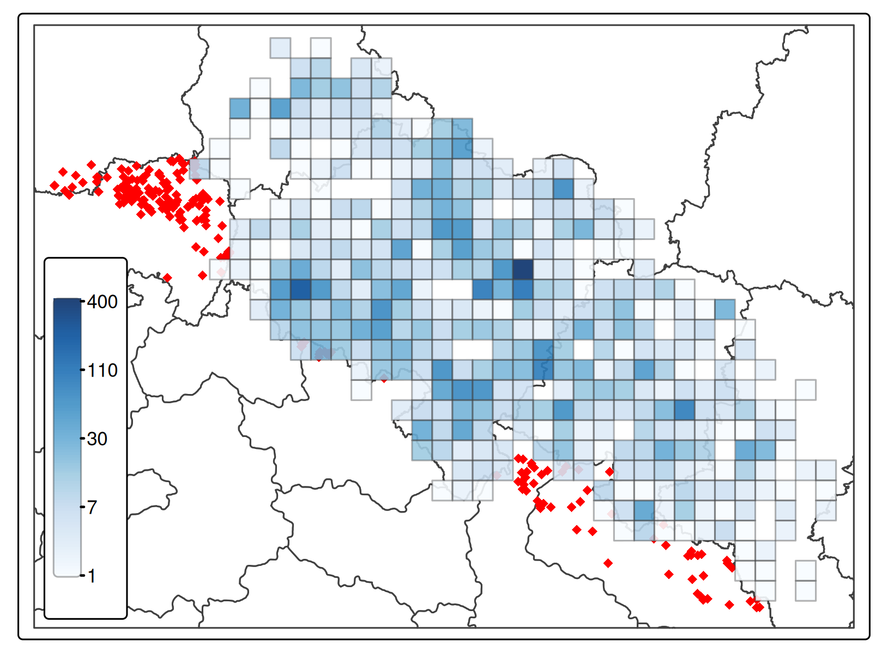

## Flora Silesiae

Historical data of the flora of Silesia based on articles published by
’Botanische Sektion\` in *Jahres-Bericht der Schlesischen Gesellschaft
für vaterländische Cultur*. Electronic versions of the reports can be
found at [Opole Digital
Library](https://www.obc.opole.pl/dlibra/publication/8613#structure) and
[Silesia Digital
Library](https://www.sbc.org.pl/dlibra/publication/11059#structure)

### How to use

The full dataset is saved into `flora_sil.Rds` file. You can read it
using:

``` r
jahres <- readRDS(file = "data/flora_sil.Rds")
```

Let’s have a look on `jahres` data frame:

``` r
jahres |>
  dplyr::slice_sample(n = 2) 
```

                species                                         citation
    1   Pirola uniflora @schalowErgebnisseDurchforschungSchlesischen1935
    2 Hieracium cymosum @schalowErgebnisseDurchforschungSchlesischen1935
                                                           entry      lon      lat
    1 Pirola uniflora Weißwasser: Muskauer Tiergarten (Militzer) 14.73606 51.55657
    2                 H. cymosum [...] Reichenstein: Molchkoppe! 16.82180 50.46998
                                                                        comments
    1 Mużaków, ogród zoologiczny (współrzędne wskazują bażanciarnię (Fasanerie))
    2            wzgórze bez nazwy obok wzg. Olchówka, Mąkolnica, gm. Złoty Stok
      year                  accepted_name
    1 1935   Moneses uniflora (L.) A.Gray
    2 1935 Hieracium cymosum Willd., 1803


Having pair of geographical coordinates – `lon[gitude]` and `lat[itude]`
– it’s very easy to convert the data frame to simple feature df, for
example using `sf` package.

``` r
jahres <- jahres |>
  subset(!is.na(lon)) |>
  sf::st_as_sf(coords = c("lon", "lat"), crs = "EPSG:4326")
```

Now it’s quite easy to run any spatial analysis like distribution, or
density. Let’s look on distribution of Malva’s:

``` r
malvas <- jahres |>
  subset(grepl("Malva", accepted_name)) |>
  subset(select = c("accepted_name", "geometry"))
```

And plot it on simple map using `tmap` package:

``` r
boundaries <- geodata::gadm(country = c("POL", "DEU", "CZE", "SVK"), level=1, path = "../data") |>
  sf::st_as_sf() |>
  sf::st_transform(crs = sf::st_crs(malvas)) |>
  sf::st_crop(sf::st_buffer(sf::st_as_sfc(sf::st_bbox(malvas)), dist = 10000))

tmap::tm_shape(boundaries) +
  tmap::tm_polygons("COUNTRY", palette = c("white"), legend.show = FALSE) +
  tmap::tm_shape(malvas) +
  tmap::tm_symbols("accepted_name", palette = "Paired", size = 0.6, shape = 16, title.col = "")
```


In Poland, occurrence of the species is usually shown in ATPOL squares.
You can get the ATPOL grid by spatial joining them with sites provided
in `jahres` data set. For that we will use `atpolR` package. As the
ATPOL grid is provided in `EPSG:2180` reference system, we have to
transform our `malva` set to it prior to run spatial join. And secondly,
as it’s used only in Poland, we have to filter out only location within
Poland’s border.

``` r
atpol10 <- atpolR::atpol10k()

malvas <- malvas |>
  sf::st_transform(crs = sf::st_crs(atpol10))

pl_border <- atpolR::boundaryPL() |>
  sf::st_polygonize() |>
  sf::st_transform(crs = sf::st_crs(atpol10))

malvas |>
  subset(apply(sf::st_within(malvas, pl_border, sparse = FALSE), 1, any)) |>
  sf::st_join(atpolR::atpol10k()) |>
  sf::st_drop_geometry() |>
  subset(select = c("accepted_name", "Name")) |>
  dplyr::arrange(accepted_name, Name)
```

                       accepted_name Name
    1              Malva moschata L. AE67
    2              Malva moschata L. BE53
    3              Malva moschata L. BE71
    4              Malva moschata L. BE74
    5              Malva moschata L. BE82
    6              Malva moschata L. BF01
    7              Malva moschata L. CE81
    8              Malva moschata L. CF11
    9            Malva parviflora L. BE49
    10 Malva trimestris (L.) Salisb. AE58
    11         Malva verticillata L. AD59
    12         Malva verticillata L. AE58
    13         Malva verticillata L. BE49
    14         Malva verticillata L. BE59
    15         Malva verticillata L. BF07
    16         Malva verticillata L. CF65


### How to participate

The source files, divided by years, are located in the **source**
directory. Entries are provided as data.frame structure, like:

``` r
jahres <- data.frame(
  species = "Cystopteris fragilis",
  citation = "@schalowErgebnisseDurchforschungSchlesischen1934",
  entry = "Cystopteris fragilis Naumburg a. B.: Schloßpark (Tscheppe)!; [...]",
  lon = 15.24453, 
  lat = 51.80259,
  comments = "Nowogród Bobrzański, park zamkowy (Wzgórze Zamkowe)"
) |> rbind(jahres)
```

Bibliography is provided as `bibentry` using `RefManageR` package

``` r
bib <- RefManageR::as.BibEntry(
  c(
    bibtype = "article",
    key  = "schalowErgebnisseDurchforschungSchlesischen1934",
    author = "Emil Schalow",
    title = "Ergebnisse der Durchforschung der schlesischen Gefässpflanzenwelt im Jahre 1933",
    journal = "Jahres-Bericht der Schlesischen Gesellschaft für vaterländische Cultur. 1933, Jg.106",
    date = "1934",
    volume = "106", 
    pages = "140--156")
)
```

There is additional file, `accepted_names.R`, located in `source/`
folder, which provides the normalization of the species names provided
by authors to common, accepted names of species, like:

``` r
an <- c(
  "Abutilon avicennae", "Abutilon theophrasti Medik.",
  "Acer campestre", "Acer campestre L.", 
  [...]
```

Feel free to spot an error or add missing data. If you recognize some
locations where geographical coordinates are missing – please add.

#### Tools and resources used to find the coordinates

- [Mapster](http://igrek.amzp.pl/)
- [Kartenforum](https://kartenforum.slub-dresden.de/)
- [Arcanum
  Maps](https://maps.arcanum.com/en/map/europe-19century-secondsurvey/)

Two map layers provided by Urząd Marszałkowski Województwa
Dolnośląskiego as ArcGIS REST service (can be used in QGIS):

- [Karte des Deutschen Reiches
  100k](https://geoportal.dolnyslask.pl/gprest/services/UMWD_DEUTSCHEN_100/MapServer/)
- [Messtischblatt
  25k](https://geoportal.dolnyslask.pl/gprest/services/UMWD_Messtischblat_nowsze/MapServer/)

[QGIS](https://qgis.org) with plugins:

- [OSM place search](https://github.com/xcaeag/Nominatim-Qgis-Plugin)
  oraz
- [Lat Lon
  Tools](https://github.com/NationalSecurityAgency/qgis-latlontools-plugin).

### Data set content

Full record sets from few articles and some records from the others, in
total 2353 records (species - localization) including 2300 with
coordinates.



## Bibliography:

### WIP
E. Schalow. “Ergebnisse der Durchforschung der schlesischen Gefässpflanzenwelt im Jahre 1933”. In:
_Jahres-Bericht der Schlesischen Gesellschaft für vaterländische Cultur. 1933, Jg.106_ 106 (1934), pp. 140-156.

### Done
F. Wimmer. “Bericht über die Verhandlungen der Botanischen Sektion im Jahre 1849”. In: _Uebersicht der
Arbeiten und Veränderungen der schlesischen Gesellschaft für vaterländische Kultur im Jahre 1849_ (1850), pp.
75-76.

F. Wimmer. “Neue und seltenere schiesische Pflanzen”. In: _Uebersicht der Arbeiten und Veränderungen der
schlesischen Gesellschaft für vaterländische Kultur im Jahre 1849_ (1850), p. 96.

E. Schalow. “Ergebnisse der Durchforschung der schlesischen Gefässpflanzenwelt im Jahre 1934”. In:
_Jahres-Bericht der Schlesischen Gesellschaft für vaterländische Cultur. 1934, Jg.107_ 107 (1935), pp. 55-71.

E. Schalow. “Ergebnisse der Durchforschung der schlesischen Gefässpflanzenwelt im Jahre 1935”. In:
_Jahres-Bericht der Schlesischen Gesellschaft für vaterländische Cultur. 1935, Jg.108_ 108 (1936), pp. 66-81.


